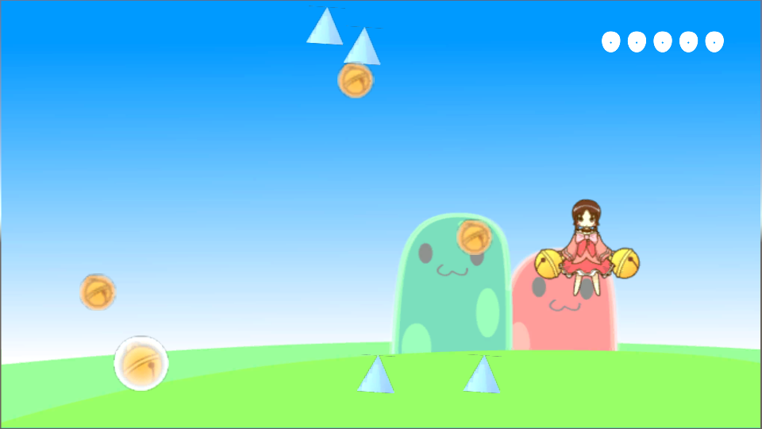
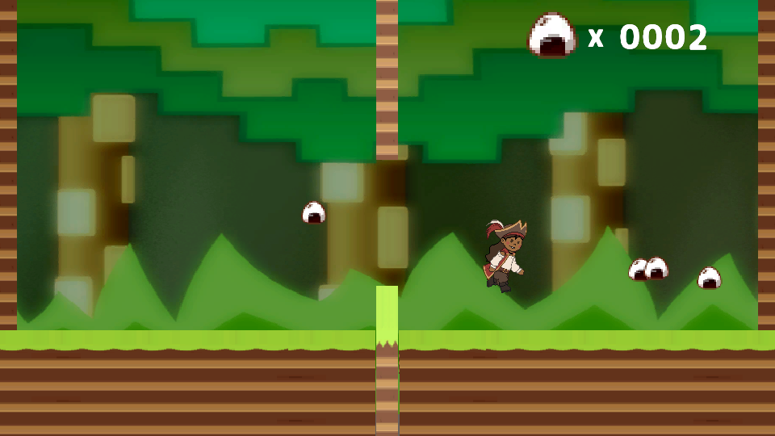

# Portfolio

- 玉井　秀兵
- 連絡先 Email [tamashuu.dat@gmail.com](tamashuu.dat@gmail.com)
- 専門学校デジタルアーツ東京 ゲームプログラムコース 2024年 3月卒業予定

## 資格
- 英検3級

## スキル
- C#
  - 利用歴1年
  - Visual Studioで独自のツールの作成が可能
- Unity
  - 利用歴1年
  - オリジナルの個人/チーム作品の開発経験あり
- C/C++
  - 利用歴1年
  - コンソールで簡単なデータ処理プログラムを開発
- Mind Render
  - 利用歴6か月
  - オリジナルゲームの制作中

## 取り組んでいるテーマ
### Unity
- 中央の壁にぶつからないよう、おにぎりを集めていくゲームのグループ制作
### MindRender
- カーアクションゲームの個人制作

## 作品リスト

### SUZUKOのスズあつめ

スズを操る不思議な少女「SUZUKO」。マウスで彼女を操作し、トゲに当たらないようスズを集めていくゲーム。

- 開発環境：Unity
- 開発期間：1か月
- デジタルアーツ東京 2022年学園祭 展示作品

### おにぎReジャンプ（制作中）

森に漂流した海賊は食糧確保のため、今日もおにぎり集めに勤しむのだった・・・。

- 開発環境：Unity
- 開発期間：1か月

## 連絡先
- E-mail [tamashuu.dat@gmail.com](tamashuu.dat@gmail.com)
