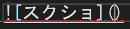

# 大見出し
## 中見出し
### 小見出し

普通の文字。
**太字**。
*斜体*。
~~取り消し~~

改行は1行空ける。

あいうえお<sub>下付き文字</sub>

X<sub>2</sub>

X<sup>2</sup>

以下抜粋。

> ここに引用部分を書く。

整数は`int`型がよい

```cs
int a;
a = 1;
Debug.Log($"a");
```

[README.md](README.md)へのリンク。



- 箇条書き
    - 段下げ
        - 段下げ２
- 続き

1. 順番１
   - 下げ
1. 順番２
    1. 順番２－１
    1. 順番２－２
1. 順番３

- [ ] 作業１
- [x] 作業２
- [ ] 作業３

|No|氏名|フリガナ|
|-:|:-:|:-|
|1|玉井|タマイ|
|2|デジタルアーツ|デジタルアーツ|
|3|池袋|イケブクロ|

